### Hi there 👋

- 💬 Ask me about: Computational Neuroscience, Machine Learning, Neural Networks (Biological and DeepNN), Mathematics, Physics, Biophysics, BioTech, MedTech. 
- 📫 How to reach me: [jantinebroek.me](http://jantinebroek.me)
- 😄 Pronouns: She/Her
- ⚡ Fun fact: A passion for learning.

</img>

<!--  -->

<!-- See for details: https://github.com/anuraghazra/github-readme-stats -->
<!-- "Ranks": "Available ranks are S+ (top 1%), S (top 25%), A++ (top 45%), A+ (top 60%), and B+ (everyone)" -->

<!--
**Jan10e/Jan10e** is a ✨ _special_ ✨ repository because its `README.md` (this file) appears on your GitHub profile.

Here are some ideas to get you started:

- 🔭 I’m currently working on ...
- 🌱 I’m currently learning ...
- 👯 I’m looking to collaborate on ...
- 🤔 I’m looking for help with ...
- 💬 Ask me about ...
- 📫 How to reach me: ...
- 😄 Pronouns: ...
- ⚡ Fun fact: ...
-->

